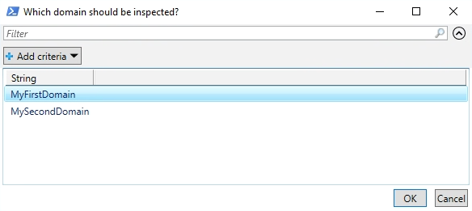
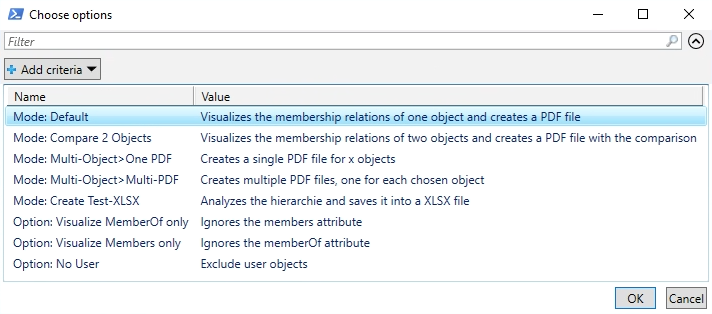
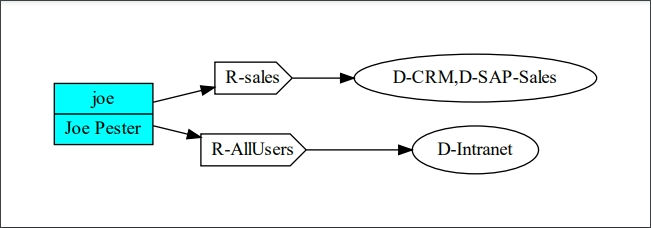
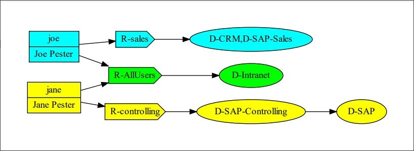

<!--
*** Thanks for checking out the Best-README-Template. If you have a suggestion
*** that would make this better, please fork the repo and create a pull request
*** or simply open an issue with the tag "enhancement".
*** Thanks again! Now go create something AMAZING! :D
***
-->

<!-- PROJECT SHIELDS -->
<!--
*** I'm using markdown "reference style" links for readability.
*** Reference links are enclosed in brackets [ ] instead of parentheses ( ).
*** See the bottom of this document for the declaration of the reference variables
*** for contributors-url, forks-url, etc. This is an optional, concise syntax you may use.
*** https://www.markdownguide.org/basic-syntax/#reference-style-links
-->
[![Contributors][contributors-shield]][contributors-url]
[![Forks][forks-shield]][forks-url]
[![Stargazers][stars-shield]][stars-url]
[![Issues][issues-shield]][issues-url]
[![GPLv3 License][license-shield]][license-url]


<br />
<p align="center">
  <a href="https://github.com/Callidus2000/ADGraph">
    
  </a>
<!-- PROJECT LOGO
-->

  <h3 align="center">ADGraph Powershell Module</h3>

  <p align="center">
    This Powershell Module utilizes the <a href="https://github.com/KevinMarquette/PSGraph/">PSGraph</a> module for visualizing membership relations in your local Active Directory.
    <br />
    <a href="https://github.com/Callidus2000/ADGraph"><strong>Explore the docs »</strong></a>
    <br />
    <br />
    <a href="https://github.com/Callidus2000/ADGraph/issues">Report Bug</a>
    ·
    <a href="https://github.com/Callidus2000/ADGraph/issues">Request Feature</a>
  </p>
</p>


<!-- TABLE OF CONTENTS -->
<details open="open">
  <summary><h2 style="display: inline-block">Table of Contents</h2></summary>
  <ol>
    <li>
      <a href="#about-the-project">About The Project</a>
      <ul>
        <li><a href="#built-with">Built With</a></li>
      </ul>
    </li>
    <li>
      <a href="#getting-started">Getting Started</a>
      <ul>
        <li><a href="#prerequisites">Prerequisites</a></li>
        <li><a href="#installation">Installation</a></li>
      </ul>
    </li>
    <li><a href="#usage">Usage</a></li>
    <li><a href="#roadmap">Roadmap</a></li>
    <li><a href="#contributing">Contributing</a></li>
    <li><a href="#license">License</a></li>
    <li><a href="#contact">Contact</a></li>
    <li><a href="#acknowledgements">Acknowledgements</a></li>
  </ol>
</details>


<!-- ABOUT THE PROJECT -->
## About The Project

This Powershell Module is visualization tool for membership relations within your local ActiveDirectory. Did you ever
* asked yourself in which nested groups a user is memberOf?
* wanted to compare group membership of multiple users?
* needed to document the current state into a pdf file?

This module provides all this.


### Built With

* [PSModuleDevelopment](https://github.com/PowershellFrameworkCollective/PSModuleDevelopment)
* [psframework](https://github.com/PowershellFrameworkCollective/psframework)
* [PSGraph](https://github.com/KevinMarquette/PSGraph/)
* [PSExcel](https://github.com/RamblingCookieMonster/PSExcel/)


<!-- GETTING STARTED -->
## Getting Started

To get a local copy up and running follow these simple steps.

### Prerequisites

All module prerequisites will be installed automatically.

The module is written for Windows Powershell 5.1 and needs the ActiveDirectory installed which is automatically available if RSAT is installed.

The module PSGraph is just a wrapper around GraphViz and is looking for it in the following paths:
C:\Program Files\NuGet\Packages\Graphviz*\dot.exe or C:\program files*\GraphViz*\bin\dot.exe

You can install it by running `Install-GraphViz` (provided by PSGraph) or just manually.

### Installation

The releases are published in the Powershell Gallery, therefor it is quite simple:
  ```powershell
  Install-Module ADGraph -Force -AllowClobber
  ```
The `AllowClobber` option is currently neccessary because of an issue in the current PowerShellGet module. Hopefully it will not be needed in the future any more.

<!-- USAGE EXAMPLES -->
## Usage
### GUI

Simplest way to get started is to use the provided mini GUI.
```powershell
Start-ADGraph
```





## Commandline usage

Everything you can do in the GUI can be done from the Commandline (as the GUI uses the same functions)
```powershell
$dn = "CN=joe,OU=Users,DC=mydomain,DC=com"
New-ADGraph -Domain "myDomain" -DN "CN=joe,OU=Users,DC=mydomain,DC=com" -ReturnType "SinglePDF" -ShowPDF $true
Get-ADUser "joe" | New-ADGraph -Domain "myDomain"
New-ADGraph -Domain "myDomain" -DN @("CN=jane,OU=Users,DC=mydomain,DC=com","CN=joe,OU=Users,DC=mydomain,DC=com") -ReturnType "SinglePDF" -ShowPDF $true

```

I hope everything else can be achieved from the integrated help.

<!-- ROADMAP -->
## Roadmap
New features will be added if any of my scripts need it ;-)

See the [open issues](https://github.com/Callidus2000/ADGraph/issues) for a list of proposed features (and known issues).

If you need a special function feel free to contribute to the project.

<!-- CONTRIBUTING -->
## Contributing

Contributions are what make the open source community such an amazing place to be learn, inspire, and create. Any contributions you make are **greatly appreciated**. For more details please take a look at the [CONTRIBUTE](docs/CONTRIBUTING.md#Contributing-to-this-repository) document

Short stop:

1. Fork the Project
2. Create your Feature Branch (`git checkout -b feature/AmazingFeature`)
3. Commit your Changes (`git commit -m 'Add some AmazingFeature'`)
4. Push to the Branch (`git push origin feature/AmazingFeature`)
5. Open a Pull Request


## Limitations
* Does only work with Windows Powershell 5.1, not Powershell Core. I will migrate as soon as the AD functionality is available cross plattform

<!-- LICENSE -->
## License

Distributed under the GNU GENERAL PUBLIC LICENSE version 3. See `LICENSE.md` for more information.


<!-- CONTACT -->
## Contact


Project Link: [https://github.com/Callidus2000/ADGraph](https://github.com/Callidus2000/ADGraph)


<!-- ACKNOWLEDGEMENTS -->
## Acknowledgements

* [Friedrich Weinmann](https://github.com/FriedrichWeinmann) for his marvelous [PSModuleDevelopment](https://github.com/PowershellFrameworkCollective/PSModuleDevelopment) and [psframework](https://github.com/PowershellFrameworkCollective/psframework)
* Icons  made by [Becris](https://www.flaticon.com/authors/becris) from [www.flaticon.com](https://www.flaticon.com/)


<!-- MARKDOWN LINKS & IMAGES -->
<!-- https://www.markdownguide.org/basic-syntax/#reference-style-links -->
[contributors-shield]: https://img.shields.io/github/contributors/Callidus2000/ADGraph.svg?style=for-the-badge
[contributors-url]: https://github.com/Callidus2000/ADGraph/graphs/contributors
[forks-shield]: https://img.shields.io/github/forks/Callidus2000/ADGraph.svg?style=for-the-badge
[forks-url]: https://github.com/Callidus2000/ADGraph/network/members
[stars-shield]: https://img.shields.io/github/stars/Callidus2000/ADGraph.svg?style=for-the-badge
[stars-url]: https://github.com/Callidus2000/ADGraph/stargazers
[issues-shield]: https://img.shields.io/github/issues/Callidus2000/ADGraph.svg?style=for-the-badge
[issues-url]: https://github.com/Callidus2000/ADGraph/issues
[license-shield]: https://img.shields.io/github/license/Callidus2000/ADGraph.svg?style=for-the-badge
[license-url]: https://github.com/Callidus2000/ADGraph/blob/master/LICENSE

